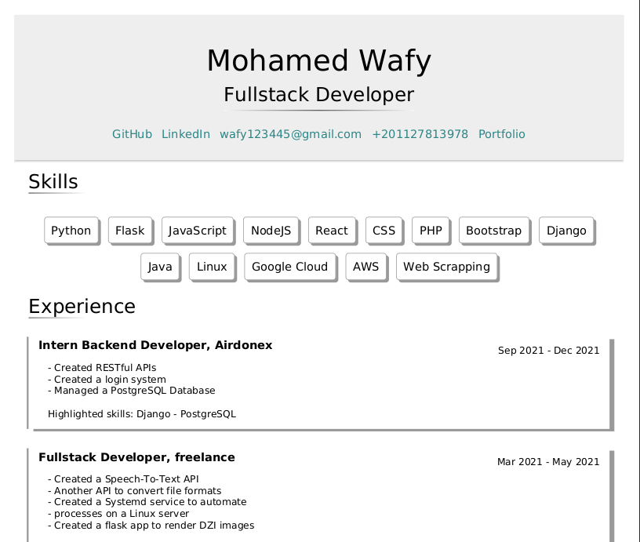

# Resume Creator
This is a python script that creates a PDF resume using variables from `vars.yaml`.

The script puts the pieces in the `layout` folder together and replaces the variable names with their values in `vars.yaml`.

If, for example, you have 3 links in your resume and want to add a 4th link, you can just add the 4th link to the `links` array in `vars.yaml`.

The layout can be modified to use more variables if needed.

# Install requirements
To install the required python libararies to run the script.
```
pip install -r requirements.txt
```

# Run
1. Add the data you want to display in the resume to `vars.yaml`
```yaml
full name: Full Name


job title: Job Title


links:
  - GitHub: https://github.com/MoWafy001
  - LinkedIn: https://linkedin.com/in/mohamedwafy
  - wafy123445@gmail.com: mailto:wafy123445@gmail.com


skills:
  - Python
  - Flask
  - Web Scrapping


experience:
  - Position, Company:
    - start date - end date
    - |
      description

education:
  - Degree, University:
    - start date - end date
    - |
      description

```
2. run the script
```
python script.py
```
or
```

python3 script.py
```

# Output
A pdf file names `out.pdf` will be created when the script is run.
